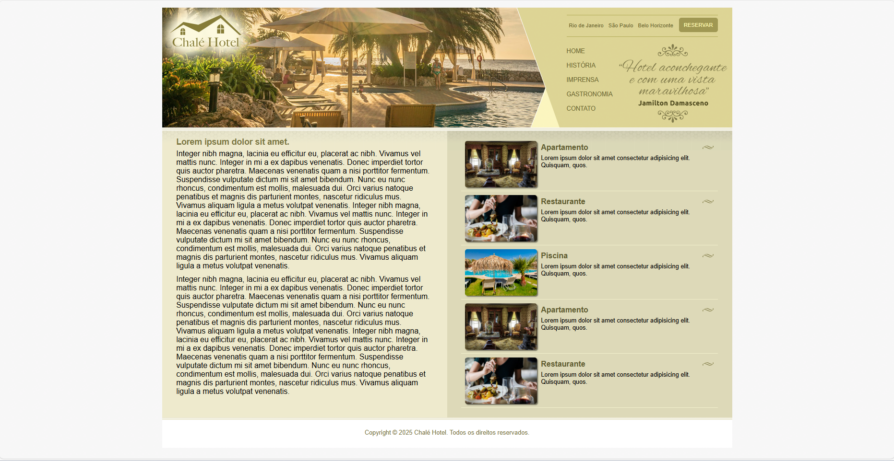

# 🏨 Chalé Hotel - Layout Responsivo

## 📋 Descrição

Este projeto apresenta um layout responsivo para um site de hotel chalé, desenvolvido com HTML5 e CSS3. O design combina elementos modernos com uma estética rústica e acolhedora, perfeita para representar um estabelecimento hoteleiro que valoriza o conforto e a natureza.

## 🎨 Características do Design

### Layout Estrutural
- **Header com Logo**: Área superior com logo posicionado estrategicamente
- **Menu de Navegação**: Menu horizontal responsivo com links para diferentes seções
- **Área de Locais**: Seção destacando as localidades atendidas pelo hotel
- **Botão de Reserva**: Call-to-action proeminente para reservas
- **Menu Lateral**: Navegação vertical com links organizados
- **Conteúdo Principal**: Área dedicada ao conteúdo principal do site
- **Área Lateral**: Seção complementar com benefícios e informações adicionais
- **Rodapé**: Informações de contato e links importantes

### Elementos Visuais
- **Paleta de Cores**: Tons terrosos e dourados que remetem à natureza
- **Tipografia**: Fonte Helvetica para melhor legibilidade
- **Imagens de Fundo**: Elementos visuais que complementam o design
- **Efeitos Hover**: Interações suaves para melhor experiência do usuário
- **Sombras e Bordas**: Elementos que conferem profundidade ao layout

## 🛠️ Tecnologias Utilizadas

- **HTML5**: Estrutura semântica e acessível
- **CSS3**: Estilização moderna com flexbox e grid
- **Design Responsivo**: Adaptação para diferentes tamanhos de tela
- **Acessibilidade**: Código otimizado para leitores de tela

## 📱 Responsividade

O layout foi desenvolvido pensando na experiência do usuário em diferentes dispositivos:
- **Desktop**: Layout completo com todas as funcionalidades
- **Tablet**: Adaptação para telas médias
- **Mobile**: Versão otimizada para smartphones

## 🎯 Funcionalidades

- Navegação intuitiva e organizada
- Sistema de reservas integrado
- Informações sobre localidades atendidas
- Apresentação de benefícios e diferenciais
- Design profissional e acolhedor

## 📸 Preview do Layout

## 🚀 Como Utilizar

1. Clone o repositório
2. Abra o arquivo `index.html` em seu navegador
3. Explore as diferentes seções do layout
4. Teste a responsividade em diferentes dispositivos

## 📞 Contato

Para dúvidas ou sugestões sobre o projeto, entre em contato através dos canais disponíveis no rodapé do site.

---

*Desenvolvido com ❤️ para proporcionar a melhor experiência digital para hóspedes e visitantes.*
